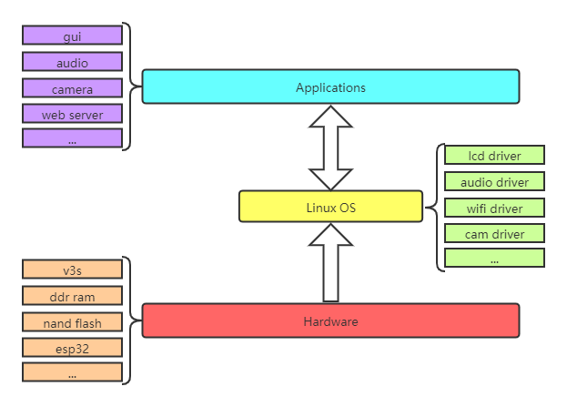

# Coonix

_Coonix_ is a funny project about building a application platform in Allwinner-v3s processor or nuvoton nuc980 processor.

### The structure of _Coonix_ is shown as follow:

## How to use
* TODO

## TODO
* Hardware schematic diagram
* Linux porting

## License

* MIT License

## Contributing

If you are pleased with this project, give me _Star_ rather than coffee:)